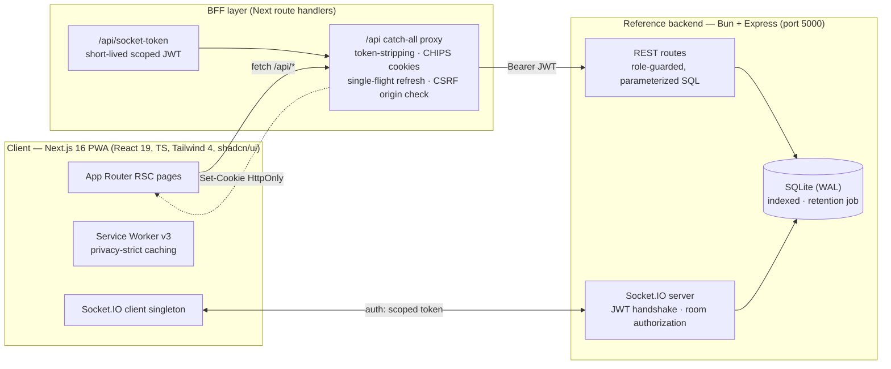

<div align="center">

# 🚌 SafeBus

**Real-time school bus tracking & fleet management — built for parents' peace of mind and operators' control.**

[](./.github/workflows/ci.yml)


*Live bus positions · code-verified pickup & drop-off · instant parent–driver–school messaging · offline-tolerant PWA*

</div>

---

## Why SafeBus

Every school morning, millions of parents hand their children to a bus and then **wait, blind**. SafeBus closes that gap: parents watch the bus approach their stop in real time and release their child only against a **rotating 6-digit verification code** — the same mechanism airports use, applied to a school run. Schools get a live fleet board, attendance truth, and an audit trail. Drivers get a distraction-light console that does the safety bookkeeping for them.

> **The wedge:** child-safety verification (codes + live ETAs) creates daily engagement; the same rails then carry payments, route optimization, and multi-school fleet SaaS.

## What's inside

| Role | Capabilities |
|---|---|
| 👨‍👩‍👧 **Parent** | Live map with per-child switcher & stop ETAs, code-gated pickup/drop-off, trip history, schedules, attendance, notifications, direct messaging, emergency reporting |
| 🚌 **Driver** | Trip lifecycle console (start → stops → arrive → end), roster with 6-digit verification + lockout protection, GPS broadcasting (5s throttle), live parent messaging |
| 🏫 **Admin** | Fleet dashboard (live buses, charts), CRUD for students/buses/routes/stops, trip monitoring, edit-request approvals, attendance oversight |
| 🛡 **Super admin** | Multi-school management, school provisioning, global user administration |

**Realtime core:** every GPS ping drives the trip state machine (auto-ETA at T-10/T-5 min, arrival detection <75 m, auto-complete) and fans out over authorized Socket.IO rooms — parents see *their* children, drivers see *their* trip, admins see *their* school. No polling anywhere in the app.

## Architecture



**Design principles**

1. **The browser never holds tokens.** `sb_at` / `sb_rt` live in `HttpOnly` cookies; auth response bodies are token-stripped at the BFF; refresh happens server-side with keyed single-flight.
2. **The backend is the only authorization boundary.** UI guards are UX conveniences; every object access is re-derived server-side (parents↔own children, drivers↔own trips, admins↔own school).
3. **Privacy-strict offline.** The service worker never caches API traffic, authenticated HTML, or non-GET requests — safety writes can never be silently replayed. Updates ship behind a user-consent banner.
4. **Contract-first.** [`docs/CONTRACTS.md`](docs/CONTRACTS.md) freezes the API + socket surface; code may deviate only by updating the contract in the same PR.

## Tech stack

- **Frontend:** Next.js 16 (App Router, RSC), React 19, TypeScript 5, Tailwind CSS 4, shadcn/ui + Radix, lucide, framer-motion (scoped), next-themes
- **Realtime:** Socket.IO 4 with JWT handshake + server-validated room joins
- **Backend:** Bun + Express reference service, SQLite (WAL) — zero-dependency persistence that runs anywhere
- **Quality:** ESLint 9 + `tsc --noEmit` CI gate, structured QA reports, ADRs for every architectural decision

## Quickstart

```bash
# 1 — frontend
bun install
cp .env.example .env
bun run dev            # http://localhost:3000

# 2 — reference backend (separate terminal; seeds demo data on first boot)
cd mini-services/safebus-backend
bun install
bun run dev            # http://localhost:5000
```

**Demo accounts** (seeded automatically in non-production; the login page offers one-click fill when `NEXT_PUBLIC_DEMO_MODE=1`):

| Role | Email | Password |
|---|---|---|
| Parent | `maria.demo@safebus.app` | `Parent123!` |
| Driver | `david.demo@safebus.app` | `Driver123!` |
| Admin | `admin.demo@safebus.app` | `Admin123!` |
| Super admin | `super.demo@safebus.app` | `Super123!` |

> Demo invite token: `INV-DEMO-2025` (driver onboarding). All data is **synthetic** — no real personal data anywhere.

## Quality & engineering record

This repo is engineered in the open:

- 📋 [`docs/QA-FINDINGS.md`](docs/QA-FINDINGS.md) — pre-launch audit (blockers → minors, all resolved)
- ✅ [`docs/QA-CHANGES.md`](docs/QA-CHANGES.md) — fix-by-fix changelog with verification evidence
- 🧾 [`docs/CONTRACTS.md`](docs/CONTRACTS.md) — frozen API/Socket.IO contract
- 📐 [`docs/adr/`](docs/adr) — architecture decision records (cookie partitioning, BFF token containment, SW privacy strategy…)
- 🧭 [`worklog.md`](worklog.md) — the full build journal, task by task
- 🐛 [Issue tracker](../../issues) — every audit finding tracked; fixes land as PRs that close their issues
- 🔒 [`SECURITY.md`](SECURITY.md) — secret policy & reporting

## Repository map

```
├── src/
│   ├── app/               # App Router: (public) auth · (app) role areas · /offline · BFF /api
│   ├── components/        # ui (shadcn) · layout · map · auth · pwa · providers
│   ├── features/          # tracking · trips · attendance · messaging · emergency · admin
│   ├── lib/               # auth (session/cookies) · api clients (BFF/server) · socket
│   └── middleware.ts      # route guards + session pre-refresh
├── mini-services/safebus-backend/   # Bun+Express reference API (routes/ lib/ seed)
├── public/                # sw.js · manifest · icons
├── docs/                  # CONTRACTS · QA reports · adr/ · history/ · README
└── scripts/               # icon generation · platform tests
```

## Roadmap

- [ ] Postgres adapter behind the same repository interface (multi-school scale)
- [ ] Push notifications (Web Push) for stage ETAs & emergency alerts
- [ ] Parent payment rails & transport-fee invoicing
- [ ] Route optimization suggestions from accumulated GPS history
- [ ] Offline queue for driver attendance (opt-in, conflict-resolved)

## License

[MIT](LICENSE) © Denis Kelvin Murithi

<div align="center">
<sub>Built to make the school run visible, verifiable, and calm.</sub>
</div>
